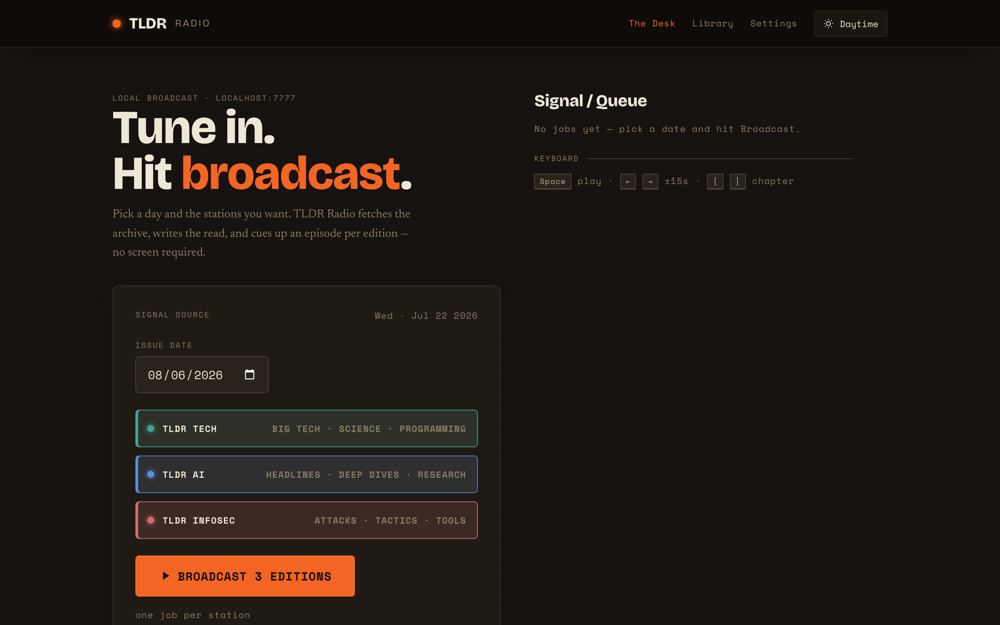
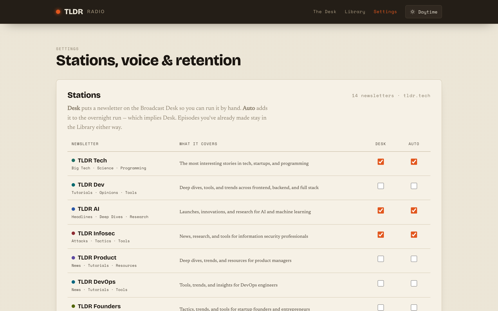
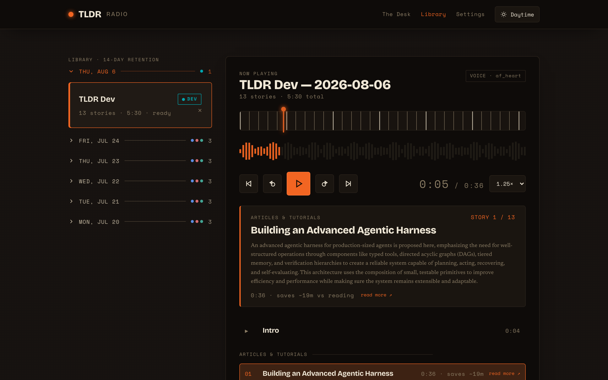
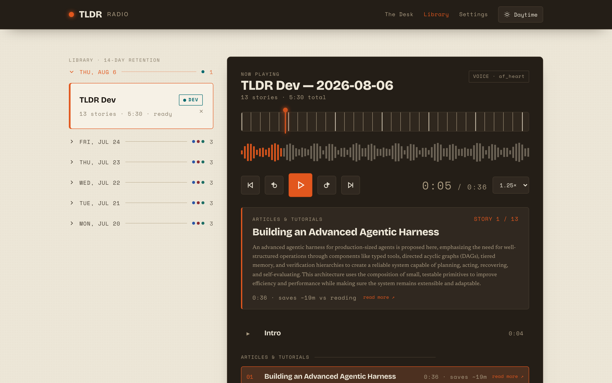

# 📻 TLDR Radio

**Turn the daily [TLDR](https://tldr.tech) newsletters into a podcast you listen to instead of read.**

Pick a day, hit **Broadcast**, and a few minutes later there are chapterized episodes waiting in
your browser — one per newsletter, each story its own track. Runs entirely on your own machine:
**no accounts, no API keys, no cloud, no LLM, $0.**

https://github.com/user-attachments/assets/8fe5d6ef-fee5-405e-8807-dc3c742a7f4d

*Two minutes of the real app — pick a date, hit **Broadcast**, then listen: story chapters,
sponsor reads and all.* **Turn the sound on** — GitHub starts embedded video muted, and this one
is worth hearing.

Featured at [22:22 in **Top 10 GitHub**](https://www.youtube.com/watch?v=SQrFue3LbwI&t=1342)
on The Next New Thing.

---

## Why this exists

TLDR publishes 14 excellent newsletters. Reading all of them is a chore; *hearing* them while you
cook or drive is not. Existing "listen to your newsletter" tools want an account, a subscription,
and your inbox. This wants a Docker daemon.

The thing that makes it trustworthy is what it **doesn't** do: **no language model touches the
text.** The pipeline is deterministic end to end — fetch the public archive page, parse it by
structure, assemble a script from templates and a pronunciation dictionary, and hand that exact
script to a local text-to-speech model that only *reads*. Nothing is summarized, rewritten, or
hallucinated. What you hear is what TLDR published.

---

## Quick start

**Requirements:** Docker Desktop (or Docker Engine + Compose v2), ~8 GB free disk, and a CPU. No
GPU needed. Works on Apple Silicon, Intel, and amd64 Linux.

```bash
git clone https://github.com/<you>/tldr-radio.git
cd tldr-radio
make doctor      # optional: checks Docker, disk, and the port before you pull 5 GB
make up          # or: docker compose up -d --build
```

Then open **<http://localhost:7777>**, pick a date, and hit **Broadcast**.

> **The first run downloads ~5 GB and takes a while.** The text-to-speech image bundles its model,
> and the container needs a minute or two to warm up before it answers. This is normal and only
> happens once — `make logs` will show `Model warmed up on cpu`. Later runs start in seconds.

You don't need a config file to start: every setting has a working default. Copy `.env.example`
to `.env` when you want your own timezone, an overnight schedule, or notifications.

```bash
make help        # all available commands
make logs        # follow both services
make down        # stop
```

### Windows and Linux

The app itself is platform-agnostic — same images, same commands, nothing to configure
differently. Two practical notes:

- **Windows:** Docker Desktop with the **WSL2** backend. `make` isn't installed by default, so use
  the Compose commands directly (or run them from WSL, where `make` is one `apt install` away).
- **Linux:** Docker Engine plus the Compose **v2** plugin. `docker-compose` v1 is EOL and won't
  parse this file.

| Instead of | Run |
|---|---|
| `make up` | `docker compose up -d --build` |
| `make down` | `docker compose down` |
| `make logs` | `docker compose logs -f` |
| `make ps` | `docker compose ps` |
| `make doctor` | `bash scripts/doctor.sh` — Git Bash (ships with Git for Windows) or WSL |

For best filesystem performance on Windows, clone into the WSL filesystem (e.g. `~/tldr-radio`)
rather than a `/mnt/c/...` path.

---

## What you get

### The Desk

Pick a date and the newsletters you want, then watch each one fetch, parse, script and synthesize
live — one card per edition, with a progress meter during synthesis.



### Stations

All 14 TLDR newsletters, each with two switches: put it on the Desk for manual runs, and/or include
it in the overnight build. The line at the bottom estimates how much audio your overnight selection
adds up to, measured from your own episodes.



### The player

A library grouped by day, one chapter per story with its section heading, the source summary and a
link to the original. Transport with ±15 s, speed up to 2.5×, auto-advance, resume where you left
off, and keyboard shortcuts. Every clip tells you roughly how much reading time it saved.

**Download** hands you the whole episode as a single tagged mp3 — album, title and author set, so
it shelves properly in a podcast or audiobook app instead of showing up as a filename. The chapter
files are joined without re-encoding, so there's no quality loss and no `ffmpeg` in the image.

### Sponsor reads

TLDR is funded by its sponsors, so this reads them out rather than quietly deleting them. Each one
becomes **its own chapter you can see coming and skip** — the audio equivalent of your eye sliding
past the ad block in the email — marked with a pill in the list, read in a **different voice**, and
opened with a spoken "a word from our sponsor" so an ad is never mistaken for the news.

Sponsors are never counted as stories: the story numbering, the intro line and the episode's story
count all step over them and keep matching the printed issue.

It's on by default. Turn it off in **Settings → Sponsor reads** — but note it's applied when an
episode is *built*, so it affects the next broadcast rather than what's already in your Library.

### Two themes

Daytime Paper and Night Broadcast, both contrast-checked. Follows your system by default; the
toggle in the header overrides it and is remembered.

| Night Broadcast | Daytime Paper |
|---|---|
|  |  |

---

## How it works

Two containers on a private network — `app` (FastAPI + a build-less vanilla JS frontend) and
`kokoro` ([Kokoro-82M](https://huggingface.co/hexgrad/Kokoro-82M) via
[Kokoro-FastAPI](https://github.com/remsky/Kokoro-FastAPI), CPU-only).

```
tldr.tech archive  →  parse  →  script  →  synthesize  →  SQLite + mp3s  →  player
   (cached HTML)    structure   templates    Kokoro-82M      ./data
```

- **Parse** keys on page *structure*, never a hardcoded list of section names, so a new newsletter
  needs no code. If a layout change ever breaks it, the job fails loudly with a story count rather
  than quietly producing a short episode.
- **Script** adds a templated intro and outro, announces section changes, and applies a
  pronunciation dictionary so "CVE-2026-1234" and "GPT-4o" are read the way you'd say them.
- **Synthesize** runs chapters in parallel within an episode; editions build one at a time.
- Everything lands in `./data` (SQLite + mp3s + cached pages) and prunes itself after 14 days.

68 voices are available; audition any of them in Settings.

---

## Configuration

Optional — `docker-compose.yml` provides a default for everything. Copy `.env.example` → `.env` to
override.

| Variable | Default | What it does |
|---|---|---|
| `TZ` | `UTC` | Your timezone, so the overnight schedule means local time (e.g. `America/Chicago`). |
| `MAX_CONCURRENT_SYNTH` | `4` | Chapters synthesized at once *within* an episode. Lower to 2 to keep the machine responsive. |
| `KOKORO_CPUS` | `6` | Hard cap on cores the TTS container may use. |
| `AUTO_BROADCAST_TIME` | *(off)* | `HH:MM` local time to build episodes overnight, e.g. `06:00`. Blank disables. |
| `AUTO_BROADCAST_EDITIONS` | `tech,ai,infosec` | **Seed only** — the initial line-up on a fresh install. Afterwards Settings → Stations owns it. |
| `AUTO_BROADCAST_RETRY_HOURS` | `4` | How long to keep re-checking a newsletter that isn't posted yet (~25 min apart). `0` = one shot. |
| `RETENTION_DAYS` | `14` | **Seed only** — days to keep episodes, mp3s and cache before the nightly prune. Afterwards Settings owns it. |
| `DEFAULT_VOICE` | `af_heart` | **Seed only** — default voice; changeable per broadcast and in Settings. |
| `INCLUDE_SPONSORS` | `true` | **Seed only** — read sponsor segments as their own skippable chapters. Afterwards Settings → Sponsor reads owns it. Applied at build time, so it affects the next broadcast. |
| `SPONSOR_VOICE` | `bm_george` | **Seed only** — voice for sponsor reads, deliberately distinct from `DEFAULT_VOICE` so an ad is audible as one. |
| `NTFY_URL` | *(off)* | Webhook pinged when the overnight run finishes or fails. An [ntfy](https://ntfy.sh) topic works as-is. |
| `PLEX_URL` / `PLEX_TOKEN` | *(off)* | Only if you share the machine with a Plex server — warns before a manual broadcast if Plex is streaming. |
| `APP_UID` / `APP_GID` | `1000` | Who the app runs as inside the container. Only needed on a Linux host where `./data` belongs to someone other than uid 1000 — see below. |

### Who the container runs as

The app runs as a non-root user, uid/gid **1000**. Since `./data` is a bind mount from your
machine, the host directory's owner is what actually decides whether episodes can be written.

On macOS and Windows this never comes up — Docker Desktop remaps mount permissions. On Linux, if
`./data` belongs to a different account, run `id -u` and `id -g` and set `APP_UID` / `APP_GID` in
`.env` to match (or `sudo chown -R 1000:1000 data`). If you get it wrong the app says so and
refuses to start, rather than failing halfway through a broadcast.

### Stations

The 14 newsletters are `tech`, `dev`, `ai`, `infosec`, `product`, `devops`, `founders`, `design`,
`marketing`, `crypto`, `fintech`, `it`, `data`, `hardware`. In **Settings → Stations** each gets:

- **Desk** — offered on the Broadcast Desk for manual runs.
- **Auto** — included in the overnight build. Auto implies Desk.

They're separate so a newsletter can sit one click away without joining every night's run. Since
editions build **one at a time**, the night scales linearly — the panel shows how much audio your
current selection adds up to, measured from your own episodes. Turning a station off never hides
episodes you already made.

### Overnight builds

Set `AUTO_BROADCAST_TIME` and `TZ` and episodes are waiting when you wake up. TLDR doesn't publish
at a fixed hour, and doesn't publish at all on weekends or holidays — so anything not yet up (or
that failed transiently) is retried every ~25 minutes for `AUTO_BROADCAST_RETRY_HOURS`, stopping
the moment it lands. Days with no issue pass quietly: nothing queued, nothing cached, no
notification. Only the final state is reported, so a run that recovers never pings you about the
attempts that didn't.

---

## Running it on an always-on machine

This is happy on modest, older hardware — it's CPU-bound but bursty, working hard for a few minutes
a few times a day and idling otherwise. Two things scale with the number of stations you enable:

- **Time.** Editions build sequentially. A few minutes each on a modern CPU; 8–15 minutes each on
  an older server chip without AVX2. Three newsletters is a short night, all fourteen is a long one.
- **Disk.** Roughly `RETENTION_DAYS` × stations × ~5 MB of mp3s, on top of the ~5 GB image.

If it shares the box with something else that wants the CPU, lower `MAX_CONCURRENT_SYNTH` and
`KOKORO_CPUS`. Budget ~2 GB RAM at peak.

---

## Development

```bash
docker run -d -p 8880:8880 --name kokoro ghcr.io/remsky/kokoro-fastapi-cpu   # TTS
python3 -m venv .venv && source .venv/bin/activate
pip install -r requirements-dev.txt
KOKORO_URL=http://localhost:8880 uvicorn app.main:app --reload --port 7777
```

Open <http://127.0.0.1:7777>.

- **Tests:** `pytest` · **Lint:** `ruff check .`
- **UI + accessibility QA:** `python qa/qa.py` — drives every page in both themes with Playwright,
  measures real contrast ratios, asserts no horizontal overflow at 390 px, and exercises the voice
  audition under a simulated slow backend. Needs `playwright install chromium webkit` once.
- **Audio integrity:** `python qa/audio_qa.py`

Frontend is deliberately build-less: no framework, no bundler, no CDN, self-hosted fonts. Edit the
files in `app/static/` and reload.

Longer-form docs live in [`docs/`](docs/) — [`spec.md`](docs/spec.md) is the full specification,
[`lessons_learned.md`](docs/lessons_learned.md) is a log of the bugs worth remembering, and
[`CHANGELOG.md`](CHANGELOG.md) is the changelog.

---

## Design

"Broadcast Desk" — warm oat paper, a dark radio faceplate, one signal-orange accent, and a distinct
colour per station. Daytime and Night themes, both contrast-checked. Fonts are Bricolage Grotesque,
Newsreader and Space Mono, self-hosted.

---

## Credits & license

- Newsletter content belongs to **[TLDR](https://tldr.tech)** — this only reads their public
  archive pages, and it reads the **sponsor segments too** (see [Sponsor reads](#sponsor-reads)),
  because their sponsors are what pay for the writing. If you enjoy the newsletters,
  [subscribe](https://tldr.tech).
- **Keep it to yourself.** This is a personal listening tool. Publishing the audio — a public feed,
  a podcast directory, YouTube — would be redistributing someone else's work, and crediting them
  isn't a licence. Ask them first.
- Speech by **[Kokoro-82M](https://huggingface.co/hexgrad/Kokoro-82M)** (Apache-2.0), served via
  **[Kokoro-FastAPI](https://github.com/remsky/Kokoro-FastAPI)**.

This project is [MIT licensed](LICENSE). It's a personal, local-first tool — not affiliated with
or endorsed by TLDR.
